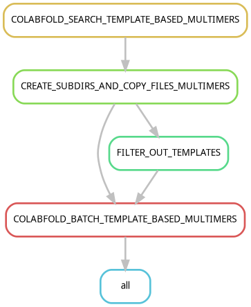

# set up the workflow
login to maxwell

clone this repo

git clone https://github.com/ntnn19/colabfold_exclude_templates

# activate the environment

module load maxwell mamba

. mamba-init

mamba activate /gpfs/cssb/group/cssb-topf/natan/colabfold_structure_prediction_workflow_maxwell/env

check example.cmd to see how to run the workflow

edit config/config.yaml with your favourite text editor

# run the workflow:

./run.sh input output ../../singularity_containers/colabfold/weights ../../colabfolddb ../../af2db/AlphaFold/pdb_mmcif/mmcif_files
